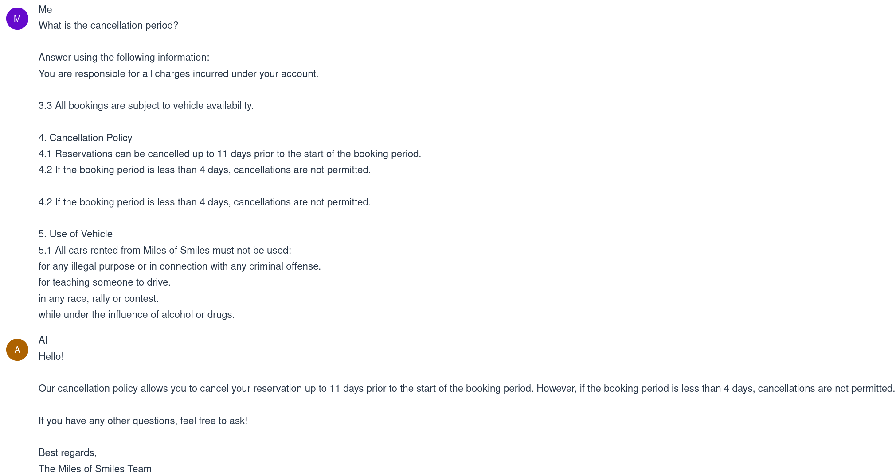
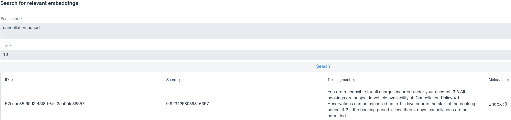

# Quarkus-LangChain4j Workshop

### What you need for this workshop
- JDK 17.0 or later
- A key for OpenAI API
- Optional: a key for Cohere API (you can get it [here](https://dashboard.cohere.com/welcome/login?redirect_uri=%2Fapi-keys)) if you want to add reranking at the end


Good to know:

1. To run the application in dev mode:
```shell script
./mvnw quarkus:dev
```

2. Open the app at http://localhost:8080/.
> **_NOTE:_**  Quarkus now ships with a Dev UI, which is available in dev mode only at http://localhost:8080/q/dev/.

3. For debugging a running Quarkus application, put your breakpoints and select Run > Attach to Process, then select the Quarkus process (in IntelliJ)

## How this workshop works
During this workshop we will create an LLM-powered customer support agent chatbot for a car rental company in 7 steps. We start from the base functionality (step 1) and add features in the subsequent steps. The result after each step is located in a separate directory (`stepXX`). The final solution is in the `step07` directory.

We recommend to start by checking out the `main` branch and then opening the
project from `step01` in your IDE and using that directory throughout the
workshop. The other option is to make a copy of it. If you later need to
reset to a particular step, either overwrite your working directory with the
directory for the step you want to reset to, or, in your IDE, open the
project from the step directory you want to reset to.

If you make any changes to the `stepXX` directories, you can always reset them back by executing:
```shell
git restore stepXX
```

> **_NOTE:_** This will make you lose all your local changes!

Before actually starting the workshop, make sure you have set the OpenAI API
key as an environment variable:

```shell
export OPENAI_API_KEY=<your-key>
```

and if you're going to use Cohere for reranking (step 7), you'll also need the Cohere API key:
```shell
export COHERE_API_KEY=<your-key>
```

Let's get started!

## STEP 0 

Download the workshop either by cloning the repository on your machine or downloading the zip file:

```
git clone https://github.com/langchain4j/quarkus-langchain4j-uphill-workshop.git
```

Or: 

```
curl -L -o workshop.zip https://github.com/langchain4j/quarkus-langchain4j-uphill-workshop/archive/refs/heads/main.zip
```

## STEP 1
To get started, make sure you use the `step01` directory, or create a copy of it.

This is a functioning skeleton for a web app with a chatbot. You can run it as follows
```shell
mvn quarkus:dev
```

or if you prefer to use the maven wrapper:
```shell
./mvnw quarkus:dev
```

> **_NOTE:_** If you run into an error about the mvnw maven wrapper, you can give execution permission for the file by navigating to the project folder and executing `chmod +x mvnw`.

or if you installed the [Quarkus CLI](https://quarkus.io/guides/cli-tooling), you can also use:
```shell
quarkus dev
```

This will bring up the page at `localhost:8080`. Open it and click the red
robot icon in the bottom right corner to start chatting with the chatbot.
The chatbot is calling GPT-4o (OpenAI) via the backend. You can test it out
and observe that it has memory.

Example:
```
User: My name is Klaus.
AI: Hi Klaus, nice to meet you.
User: What is my name?
AI: Your name is Klaus.
```

This is how memory is built up for LLMs


In the console, you can observe the calls that are made to OpenAI behind the scenes, notice the roles 'user' (`UserMessage`) and 'assistant' (`AiMessage`).

## STEP 2
Play around with the model parameters in
`src/main/resources/application.properties`. If you don’t have
autocompletion, you can search through them in the Quarkus DevUI at
`localhost:8080/q/dev` under `Configuration` (use the filter
to find properties containing `openai.chat-model`).

> **_IMPORTANT:_** After changing a configuration property, you need to
force a restart the application to apply the changes. Simply submitting a
new chat message in the UI does not trigger it (it only sends a websocket
message rather than an HTTP request), so you have to refresh the page in
your browser.

The precise meaning of most model parameters is described on the website of
OpenAI: https://platform.openai.com/docs/api-reference/chat/create

Examples to try:

- `quarkus.langchain4j.openai.chat-model.temperature` controls the
  randomness of the model's responses. Lowering the temperature will make the
  model more conservative, while increasing it will make it more creative. Try
  asking "Describe a sunset over the mountains" while setting the temperature
  to 0.1 and then to, say, 1.5, and observe the different style of the
  response. With a too high temperature over 1.5, the model often starts
  producing garbage, or fails to produce a valid response at all.

- `quarkus.langchain4j.openai.chat-model.max-tokens` limits the length of the
  response. Try setting it to 50 and see how the model cuts off the response
  after 50 tokens.

- `quarkus.langchain4j.openai.chat-model.frequency-penalty` defines how much
  the model should avoid repeating itself. Try setting the penalty to 2 (which
  is the maximum for OpenAI models) and see how the model tries to avoid
  repeating words in a single response. For example, ask it to "Repeat the
  word hedgehog 50 times". While with frequency penalty around 0, the model
  gladly repeats the word 50 times, but with 2, it will most likely start
  producing garbage after repeating the word a few times.

## STEP 3
Instead of passing the response as one block of text when it is ready, enable streaming mode. This will allow us to display the reply token per token, while they come in.

It is achieved by changing the return type of `CustomerSupportAgent.chat()`
to the reactive `Multi<String>`. You'll have to update the
`CustomerSupportAgentWebSocket.onTextMessage()` method accordingly to
return a `Multi` too.

Unfortunately, the UI used in this workshop does not properly support
streaming mode at this moment, so it will look somewhat ugly. After
experimenting, please revert back the changes before moving to Step 4.

In the next step, we will fix the problem where the model still doesn't know 
its role as a car rental customer assistant:

```
User: Can I cancel my booking?
AI: No, I don't know what you are talking about ...
```

## STEP 4 

Add a `SystemMessage` so the model knows it is a car rental customer
assistant. This is done by adding a `@SystemMessage` annotation to the
`CustomerSupportAgent.chat()` method. The value of the annotation should be:

> You are a customer support agent of a car rental company 'Miles of Smiles'.
> You are friendly, polite and concise.

Observe that the agent is now happy to help with bookings, but does make
rules up when it comes to cancellation period.

Example:
```
User: Can I cancel my booking?
AI: Yes, I can help you with that ...
User: What is the cancellation period?
AI: [some nonsense]
```

## STEP 5
Add a RAG system that allows the chatbot to use relevant parts of our Terms of Use (you can find them [here](https://github.com/LizeRaes/quarkus-langchain4j-uphill-workshop/blob/main/src/main/resources/data/miles-of-smiles-terms-of-use.txt)) for answering the customers.

1. Ingestion phase: the documents (files, websites, ...) are loaded, split, turned into meaning vectors (embeddings) and stored in an embedding store


2. Retrieval phase: with every user prompt, the relevant fragments of our documents are collected by comparing the meaning vector of the prompt with the vectors in the embedding store. The relevant segments are then passed along to the model together with the original question.


More info on easy RAG in Quarkus can be found [here](https://docs.quarkiverse.io/quarkus-langchain4j/dev/easy-rag.html).

To add RAG to the application, let's use the Easy RAG extension:

```
<dependency>
    <groupId>io.quarkiverse.langchain4j</groupId>
    <artifactId>quarkus-langchain4j-easy-rag</artifactId>
    <version>${quarkus-langchain4j.version}</version>
</dependency>
```

Add the following configuration to `application.properties`:

```
quarkus.langchain4j.easy-rag.path=src/main/resources/data
quarkus.langchain4j.easy-rag.max-segment-size=100
quarkus.langchain4j.easy-rag.max-overlap-size=25
quarkus.langchain4j.easy-rag.max-results=3
```

Explanation:

- `quarkus.langchain4j.easy-rag.path` is the path to the directory with the
  documents. This is the only mandatory property.
- `quarkus.langchain4j.easy-rag.max-segment-size` is the maximum size of a
  segment in tokens. 
- `quarkus.langchain4j.easy-rag.max-overlap-size` is the maximum size of the
  overlap (between adjacent segments) in tokens.
- `quarkus.langchain4j.easy-rag.max-results` is the maximum number of
  segments to return while searching for relevant segments.

Now let's try to chat with the bot:

```
User: What is the cancellation period?
AI: ... 11 days ... 4 days ...
```

Let's now also have a look at Dev UI, because it has some nice features that
allow you to see deeper into how RAG works. Open the Dev UI either by
pressing 'd' in the terminal where Quarkus is running, or by opening
`localhost:8080/q/dev` in your browser.

Let's try to talk to the chatbot through the Dev UI interface. Click the
'Chat' button inside the 'LangChain4j' card. The system message should get
populated automatically. Make sure the 'Enable RAG' checkbox is checked, and
try asking the same question again. You will notice that when the response
arrives, your message will be replaced by the augmented message, containing
the extra context added by the retrieval augmentor.



Another interesting feature is being able to search just for relevant
embeddings to any question, without actually submitting the question to the
chatbot. This is under the 'Embedding store' link in the 'LangChain4j' card.
In the bottom of the page, there's a form titled 'Search for relevant
embeddings'. Try searching for 'cancellation period' and you will see that
segments that talk about the cancellation period should pop up at the
top and have a higher relevance score.



Note: if you want to log the requests and responses of the embedding model, 
set these two properties, but be aware that they are very long and make
the log hard to read:

```
quarkus.langchain4j.openai.embedding-model.log-requests=true
quarkus.langchain4j.openai.embedding-model.log-responses=true
```

## STEP 6

Now let's give the bot the ability to work with customers and their bookings.
We won't use a real database, only a simple CDI bean that imitates a database.

Create records for Booking and Customer:

```
public record Booking(String bookingNumber, 
                      LocalDate dateFrom, 
                      LocalDate dateTo, 
                      Customer customer) {
}

public record Customer(String name, 
                       String surname) {
}
```

Create an empty application-scoped bean named `BookingService` to act as the repository of bookings.
Then create a class `BookingTools` that holds the tools for working with bookings and injects the `BookingService`:

```java
@ApplicationScoped
public class BookingTools {

    @Inject
    BookingService bookingService;

    @Tool
    public Booking getBookingDetails(String bookingNumber, String customerName, String customerSurname) {
        System.out.println("==========================================================================================");
        System.out.printf("[Tool]: Getting details for booking %s for %s %s...%n", bookingNumber, customerName, customerSurname);
        System.out.println("==========================================================================================");

        return bookingService.getBookingDetails(bookingNumber, customerName, customerSurname);
    }

    @Tool
    public void cancelBooking(String bookingNumber, String customerName, String customerSurname) {
        System.out.println("==========================================================================================");
        System.out.printf("[Tool]: Cancelling booking %s for %s %s...%n", bookingNumber, customerName, customerSurname);
        System.out.println("==========================================================================================");

        bookingService.cancelBooking(bookingNumber, customerName, customerSurname);
    }
}
```

Also don't forget to make these tools available to the AI Service (you have to
add the `tools = BookingTools.class` parameter to the `@RegisterAiService`
annotation).

Try to add and implement the required methods in the `BookingService` bean.
You can choose what bookings should be available out of the box and add them
inside a `@PostConstruct` method.

An example solution follows:

```java
@ApplicationScoped
public class BookingService {

    private List<Booking> bookings = new ArrayList<>();

    @PostConstruct
    public void initialize() {
        // can't be cancelled because it is shorter than 4 days
        Booking booking1 = new Booking("123-456",
                LocalDate.now().plusDays(17),
                LocalDate.now().plusDays(19),
                new Customer("Klaus", "Heisler"));
        bookings.add(booking1);
        // can't be cancelled because it starts in less than 11 days
        Booking booking2 = new Booking("111-111",
                LocalDate.now().plusDays(2),
                LocalDate.now().plusDays(8),
                new Customer("David", "Wood"));
        bookings.add(booking2);
        // can be cancelled
        Booking booking3 = new Booking("222-222",
                LocalDate.now().plusDays(12),
                LocalDate.now().plusDays(21),
                new Customer("Martin", "Oak"));
        bookings.add(booking3);
    }

    public void cancelBooking(String bookingNumber, String customerName, String customerSurname) {
        Booking booking = getBookingDetails(bookingNumber, customerName, customerSurname);
        // too late to cancel
        if(booking.dateFrom().minusDays(11).isBefore(LocalDate.now())) {
            throw new BookingCannotBeCancelledException(bookingNumber);
        }
        // too short to cancel
        if(booking.dateTo().minusDays(4).isBefore(booking.dateFrom())) {
            throw new BookingCannotBeCancelledException(bookingNumber);
        }
        bookings.remove(booking);
    }

    public Booking getBookingDetails(String bookingNumber, String customerName, String customerSurname) {
        return bookings.stream()
                .filter(booking -> booking.bookingNumber().equals(bookingNumber))
                .filter(booking -> booking.customer().name().equals(customerName))
                .filter(booking -> booking.customer().surname().equals(customerSurname))
                .findAny()
                .orElseThrow(() -> new BookingNotFoundException(bookingNumber));
    }
}
```

Observe how the chatbot behaves now.
You can ensure that the tool methods are called by looking at the console logs.

Example:
```
User: Cancel my booking
AI: Please provide your booking number, name and surname...
```

The sample solution contains three bookings created automatically at start:
- Booking for Klaus Heisler, number 123-456: can't be cancelled because it is shorter than 4 days
- Booking for David Wood, number 111-111: can't be cancelled because it starts in less than 11 days
- Booking for Martin Oak, number 222-222: can be cancelled

Note that we have applied safeguards for the cancellation period and the
minimum booking length in the example solution. In some cases, the LLM may
apply these automatically because we still have RAG in place and the LLM can
deduce these rules from the terms of use, and skip executing the
`cancelBooking` method. But generally, it is safer to have these checks in
place in the backend as well and not rely on the model to apply them.

## STEP 7
Let’s make RAG better: add a RetrievalAugmentor with a QueryCompressor and a Reranker (using your Cohere key)
More details on advanced RAG can be found [here](https://github.com/langchain4j/langchain4j/pull/538).
