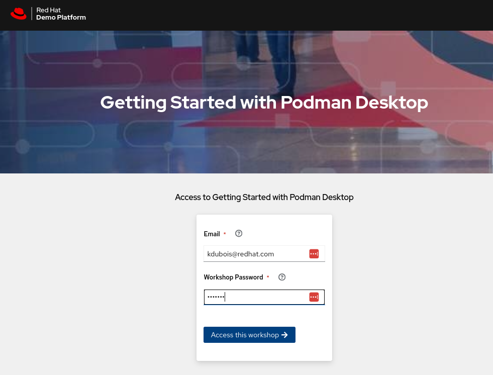
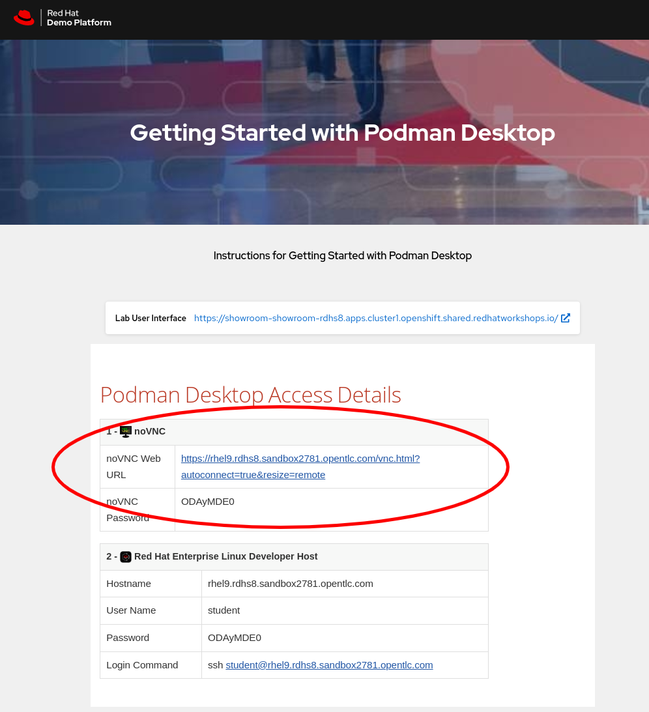
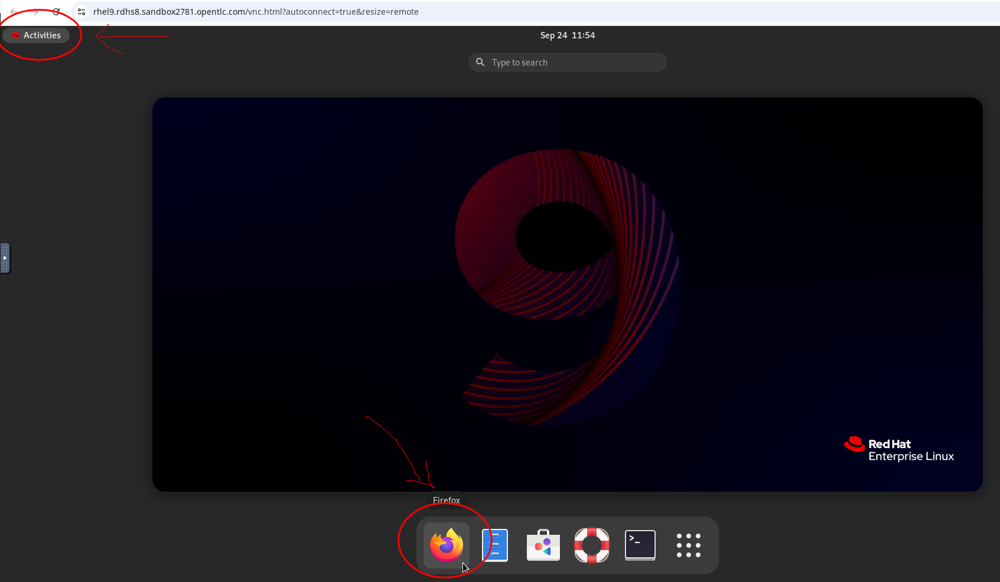
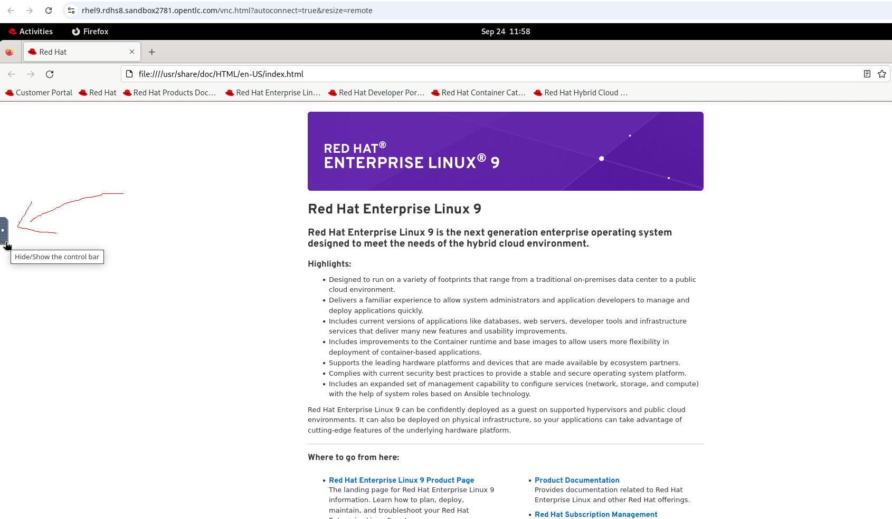
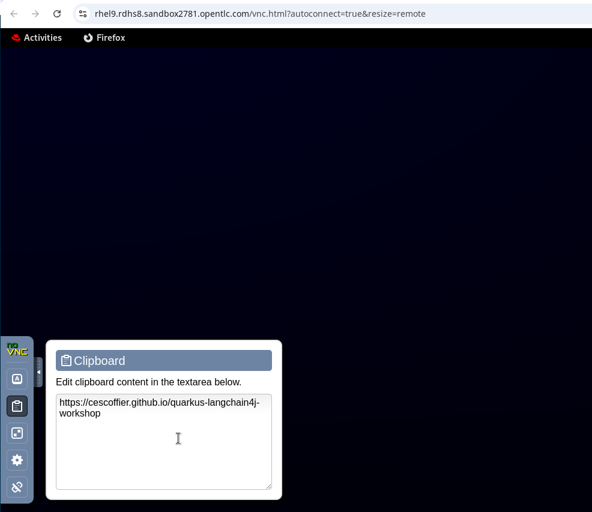
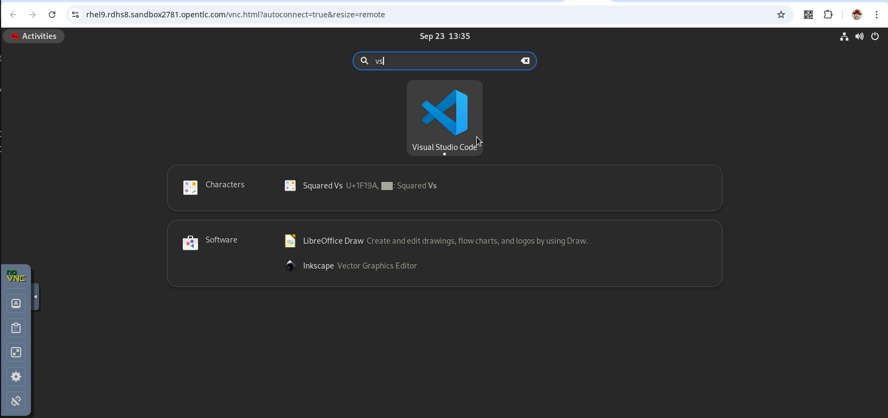

# Getting started with your virtual environment

We have prepared a virtual environment that you can use for going through the lab.
You should have received a URL to log in to this virtual environment. Go ahead and access it from your browser.

You will see a page that says "Getting started with Podman Desktop".

!!! note "Getting started with Podman Desktop?"
    Don't worry about this title, it just so happens that we have originally created this environment for a Podman Desktop lab. Fortunately it suits our needs for the Quarkus LangChain4j lab as well :).

Fill out the fields with an email address (it's just a unique identifier for the lab, we're not actually doing anything with it), and the password that was provided to you by the lab instructors.

Once you click on "Access this workshop", you'll see the workshop landing page.

Copy the noVNC Password value, and then click on the noVNC Web URL link. This will give you access to a
virtual Linux machine based on Red Hat Enterprise Linux (RHEL).

## Open a browser and the instructions in the Virtual Machine

Let's open a browser in the VM and pull up the lab instructions. This will make our lives easier when we need to copy & paste values from the lab instructions into our code editor. Click on the Activities button at the top left. You should see a Firefox icon in the bar at the bottom of the screen, so go ahead and open it.

Now comes the tricky part. We need to copy and paste the workshop URL from our host to the Virtual Machine. In order to do so, you will need to find the little control bar tab on the left side of the VM screen as seen in the image below.

When you click on it, you will see the control bar expand. Select the clipboard icon, and now you should see a clipboard field which will allow you to copy text between your host and your VM. Copy the workshop url: [https://quarkusio.github.io/quarkus-langchain4j-workshop/rhel-setup](https://quarkusio.github.io/quarkus-langchain4j-workshop/rhel-setup) and paste it in this field. Now paste the same value in the Firefox browser address bar to pull up the workshop instructions.

Whew! You should now see the instructions in your browser. Feel free to hide the clipboard and control bar. Note that you might need to do the same thing to copy/paste the OpenAI API key if you have it somewhere on your host machine.

## Launch the code editor (VS Code)

Inside the VM there is already a VS Code instance for you to use. To access it, go ahead and click on the Activities button and in the search bar that appears, type "VS code". Then click on the icon to open it.

Great! Now we will need to install the final requirements before we can officially get started with the LangChain4j lab :).  

## Install SDKMAN! to install Java

The VM currently does not have Java installed. SDKMAN! is a handy tool to install JVM based apps, including an OpenJDK which we will need for the lab.

Open a terminal in VS Code (either click on the "terminal" menu item at the top or, from within VS Code, type Ctrl+Shift+`). In the terminal, execute the following command to install zip which is needed to for the SDKMAN! installation.

`sudo dnf install -y zip unzip`

!!! note "Keyring?"
    If you get prompted to set a keyring password, set it to 'quarkus'

Now finally we can install SDKMAN!, and then use it to install OpenJDK (and while we're at it, also the Quarkus CLI). We'll do this in one go with the following command:

`curl -s "https://get.sdkman.io" | bash && source "/home/student/.sdkman/bin/sdkman-init.sh" && sdk install java 21.0.4-tem && sdk install quarkus`

Well done! You can now go back to the [original requirements page](./requirements.md) and get started with the lab:
