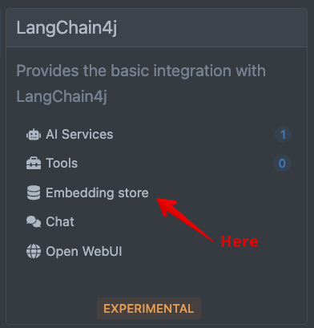
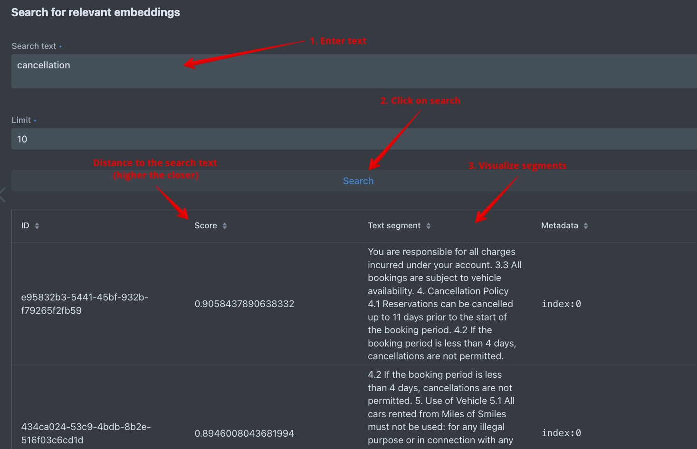
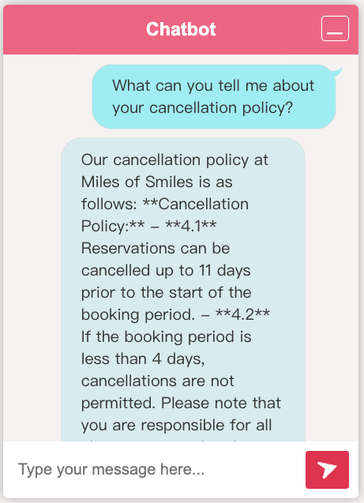

# Step 05 - Introduction to the RAG pattern

In this step, we will introduce the RAG pattern and implement it in our AI service.
The [RAG (Retrieval Augmented Generation) pattern](https://research.ibm.com/blog/retrieval-augmented-generation-RAG){:target="_blank"} is a way to extend the knowledge of the LLM used in the AI service.

Indeed, the LLM is trained on a very large dataset.
But this dataset is general and does not contain specific information about your company, your domain of expertise, or any information that could change frequently.
The RAG pattern allows you to add a _knowledge base_ to the LLM.

The RAG pattern is composed of two parts:

- **Ingestion**: This is the part that stores data in the knowledge base.
- **Augmentation**: This is the part that adds the retrieved information to the input of the LLM.

We will see these two parts in the next steps, but first let's use [EasyRag](https://docs.quarkiverse.io/quarkus-langchain4j/dev/easy-rag.html){target="_blank"} to get started and understand the RAG pattern.
EasyRag abstracts most of the complexity of implementing the RAG pattern.
Basically, you drop your data in a configured directory, and _voilà_!

If you want to see the final result of this step, you can check out the `step-05` directory.

## Adding the Easy Rag dependency

First, we need to add the EasyRag dependency to our project.
Add the following dependency to your `pom.xml` file:

```xml title="pom.xml"
--8<-- "../../step-05/pom.xml:easy-rag"
```

!!! tip
    You could also open another terminal and run

    ```shell
    ./mvnw quarkus:add-extension -Dextension=easy-rag
    ```

!!! note "Reloading"
    If your application is running in dev mode, it will automatically restart with the new dependency.

## Adding some data

The RAG pattern allows to extend the LLM knowledge with your own data.
So, let's add some data.

==Create a directory named `rag` in the `src/main/resources` directory.
Then, create a file named `miles-of-smiles-terms-of-use.txt` in the `rag` directory with the following content:==

```text title="miles-of-smiles-terms-of-use.txt"
--8<-- "../../step-05/src/main/resources/rag/miles-of-smiles-terms-of-use.txt"
```
Alternatively, you can copy the `miles-of-smiles-terms-of-use.txt` file from the `step-05/src/main/resources/rag` directory.

Note that we are adding a single file, but you can add as many files as you want in the `rag` directory.
Also, it's not limited to text files, you can use PDF, Word, or any other format.
See the [EasyRag documentation](https://docs.quarkiverse.io/quarkus-langchain4j/dev/easy-rag.html){target="_blank"} for more information.

## Configuring EasyRag

Now that we have some data, we need to configure EasyRag to ingest it.
==In the `src/main/resources/application.properties` file, add the following configuration:==

```properties title="application.properties"
--8<-- "../../step-05/src/main/resources/application.properties:easy-rag"
```

Let's look at the configuration:

- `quarkus.langchain4j.easy-rag.path`: The path to the directory containing the data files.
- `quarkus.langchain4j.easy-rag.max-segment-size`: The maximum number of tokens in a segment. Indeed, each document is split into segments (chunks) to be ingested by the LLM. This parameter defines the maximum number of tokens in a segment.
- `quarkus.langchain4j.easy-rag.max-overlap-size`: The maximum number of tokens to overlap between two segments. So, each segment overlaps with the previous one by this number of tokens. That allows the LLM to have a context between two segments.
- `quarkus.langchain4j.easy-rag.max-results`: The maximum number of results to return when querying the knowledge base.

## Testing the RAG pattern

Let's test the RAG pattern.
Make sure the application is running and open the browser at [http://localhost:8080](http://localhost:8080).

### Ingestion and Embedding

When you start the application, you should see the following lines in the log :

```bash
INFO  [io.qua.lan.eas.run.EasyRagIngestor] (Quarkus Main Thread) Ingesting documents from path: src/main/resources/rag, path matcher = glob:**, recursive = true
INFO  [io.qua.lan.eas.run.EasyRagIngestor] (Quarkus Main Thread) Ingested 1 files as 8 documents
```

That data from the `rag` directory is being ingested.
The files are read from the configured directory, split into segments, and stored in the knowledge base.
In our case, the knowledge base is _in memory_.
We will see in the next steps how to use a persistent knowledge base.

The segments are not stored as-is in the knowledge base.
They are transformed into vectors, also called _embeddings_.
This is a way to represent the text in a numerical form.
So, in the knowledge base, we have the text and the corresponding embeddings.
These embeddings are computed using _embedding models_.
Right now, we use the [default embedding model provided by OpenAI](https://platform.openai.com/docs/guides/embeddings){target="_blank"}.
We will see in the next steps how to use your own embedding model.

Let's have a look at the content of our knowledge base.
==Open the browser to [http://localhost:8080/q/dev-ui](http://localhost:8080/q/dev-ui/).
This is the Quarkus Dev UI, the toolbox with everything you need to develop your Quarkus application.
Locate the _LangChain4j_ tile, and click on the _Embedding store_ link:==



==Then, look for the `Search for relevant embeddings` section.
Enter a query in the `Search text` field, for example, `Cancellation`, and then click on the `Search` button:==



You should see the segments _close_ to the searched text.
You can visualize the segments, but also their score, i.e., how close they are to the searched text.

To find relevant segments, it computes the embeddings of the searched text and compares them to the embeddings of the segments.
It applies a similarity search using a distance computation (like the [cosine similarity](https://en.wikipedia.org/wiki/Cosine_similarity){target="_blank"}).
The closer the embeddings, the higher the score.

### Augmentation

Let's now go back to our chatbot and test the RAG pattern.
==Open the browser at [http://localhost:8080](http://localhost:8080).
Ask a question related to the terms of use:==

```
What can you tell me about your cancellation policy?
```



As you can see the AI is able to answer the question, and use the relevant segment from the knowledge base.

Let's look at the logs.
You should see the following lines:

```json
{
    "role" : "user",
    "content" : "What can you tell me about your cancellation policy?\n\nAnswer using the following information:\nYou are responsible for all charges incurred under your account.\n\n3.3 All bookings are subject to vehicle availability.\n\n4. Cancellation Policy\n4.1 Reservations can be cancelled up to 11 days prior to the start of the booking period.\n4.2 If the booking period is less than 4 days, cancellations are not permitted.\n\n4.2 If the booking period is less than 4 days, cancellations are not permitted.\n\n5. Use of Vehicle\n5.1 All cars rented from Miles of Smiles must not be used:\nfor any illegal purpose or in connection with any criminal offense.\nfor teaching someone to drive.\nin any race, rally or contest.\nwhile under the influence of alcohol or drugs.\n\n3. Bookings\n3.1 Users may make a booking through our website or mobile application.\n3.2 You must provide accurate, current and complete information during the reservation process. You are responsible for all charges incurred under your account.\n3.3 All bookings are subject to vehicle availability."
  }
```

The `content` starts with the user query, but then the AI service adds the relevant segment from the knowledge base.
It extends the _prompt_ with the relevant information.
This is the augmentation part of the RAG pattern.
The LLM receives the extended prompt and can provide a more accurate response.

## Conclusion

In this step, we introduced the RAG pattern and implemented it in our AI service.
We used EasyRAG to simplify the setup.
In the [next step](./step-06.md), we will start deconstructing the RAG pattern to understand how it works under the hood and how to customize it.
