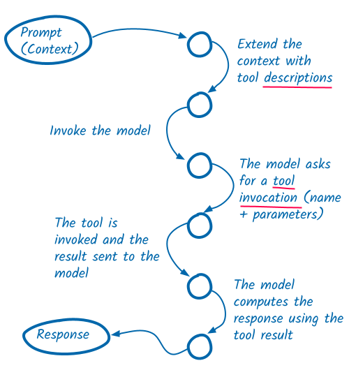

# Step 06 - Function calling and Tools

The RAG pattern allows passing knowledge to the LLM based on your own data.
It's a very popular pattern, but not the only one that can be used.

In this step, we are going to see another way to give superpowers to the LLM: [Function Calling](https://docs.quarkiverse.io/quarkus-langchain4j/dev/agent-and-tools.html){target="_blank"}.
Basically, we will allow the LLM to call a function that you have defined in your code.
The LLM will decide when and with which parameters to call the function.
Of course, makes sure that you do not allow the LLM to call a function that could be harmful to your system, and make sure to sanitize any input data.

## Function calling

Function calling is a mechanism offered by some LLMs (GPTs, Llama...). It allows the LLM to call a function that you have defined in your application.
When the application sends the user message to the LLM, it also sends the list of functions that the LLM can call.

Then the LLM can decide, if it wants, to call one of these functions with the parameters it wants.
The application receives the method invocation request and executes the function with the parameters provided by the LLM.
The result is sent back to the LLM, which can use it to continue the conversation, and compute the next message.



In this step, we are going to see how to implement function calling in our application.
We will set up a database and create a function that allows the LLM to retrieve data (bookings, customers...) from the database.

The final code is available in the `step-06` folder.
However, we recommend you follow the step-by-step guide to understand how it works, and the different steps to implement this pattern.

## A couple of new dependencies

Before starting, we need to install a couple of new dependencies.
==Open the `pom.xml` file and add the following dependencies:==

```xml title="pom.xml"
--8<-- "../../step-07/pom.xml:step-7"
```

!!! tip
    You could also open another terminal and run

    ```shell
    ./mvnw quarkus:add-extension -Dextensions="hibernate-orm-panache,jdbc-postgresql"
    ```

If you are not familiar with Panache, it's a layer on top of Hibernate ORM that simplifies the interaction with the database.
You can find more information about Panache [here](https://quarkus.io/guides/hibernate-orm-panache){target="_blank"}.

## Preparing the entities

Now that we have the dependencies, we can create a couple of entities.
We are going to store a list of bookings in the database.
Each booking is associated with a customer.
A customer can have multiple bookings.

==Create the `dev.langchain4j.quarkus.workshop.Customer` entity class with the following content:==

```java title="Customer.java"
--8<-- "../../step-07/src/main/java/dev/langchain4j/quarkus/workshop/Customer.java"
```

==Then create the `dev.langchain4j.quarkus.workshop.Booking` entity class with the following content:==

```java title="Booking.java"
--8<-- "../../step-07/src/main/java/dev/langchain4j/quarkus/workshop/Booking.java"
```

==While we are at it, let's create the `dev.langchain4j.quarkus.workshop.Exceptions` class containing a set of `Exception`s we will be using:==

```java title="Exceptions.java"
--8<-- "../../step-07/src/main/java/dev/langchain4j/quarkus/workshop/Exceptions.java"
```

Alright, we have our entities and exceptions.
Let's add some data to the database.

==Create the `src/main/resources/import.sql` file with the following content:==

```sql title="import.sql"
--8<-- "../../step-07/src/main/resources/import.sql"
```

This file will be executed when the application starts, and will insert some data into the database.
Without specific configuration, it will only be applied in dev mode (`./mvnw quarkus:dev`).

## Defining Tools

Alright, we now have everything we need to create a function that allows the LLM to retrieve data from the database.
We are going to create a `BookingRepository` class that will contain a set of functions to interact with the database.

==Create the `dev.langchain4j.quarkus.workshop.BookingRepository` class with the following content:==

```java title="BookingRepository.java"
--8<-- "../../step-07/src/main/java/dev/langchain4j/quarkus/workshop/BookingRepository.java"
```

The _repository_ defines three methods:

- `cancelBooking` to cancel a booking. It checks if the booking can be cancelled and deletes it from the database.
- `listBookingsForCustomer` to list all bookings for a customer.
- `getBookingDetails` to retrieve the details of a booking.

Each method is annotated with the `@Tool` annotation.
That is how we tell the LLM that these methods can be called.
The optional value of the annotation can gives more information about the tool, so the LLM can pick the right one.

## Giving a toolbox to the LLM

==Let's now modify our AI service interface (`dev.langchain4j.quarkus.workshop.CustomerSupportAgent`):==

```java hl_lines="7 18 20-21" title="CustomerSupportAgent.java"
--8<-- "../../step-07/src/main/java/dev/langchain4j/quarkus/workshop/CustomerSupportAgent.java"
```

We have added the `@Toolbox` annotation to the `chat` method.
It lists the classes that contain the tools that the LLM can call.

Also note that we have added a new placeholder `{current_date}` in the system prompt, so the LLM knows the current date (and can apply the cancellation policy).

!!! note "Prompt and templates"
    The system message and user messages can contain placeholders.
    The placeholders are replaced by the values provided by the application.
    You can pass parameters to AI service methods and include them in the prompt.
    It uses the [Qute](https://quarkus.io/guides/qute) template engine underneath.
    This is a powerful feature to allow you to have advanced template logic.

!!! bug "Tools and streaming responses"
    There is a known limitation currently when using (blocking) tools with streaming responses.
    Replace `Multi<String>` with `String` in the AI service method signature to avoid this issue and change the call in the `dev.langchain4j.quarkus.workshop.CustomerSupportAgentWebSocket` accordingly:

    ```java hl_lines="2" title="CustomerSupportAgentWebSocket.java"
    --8<-- "../../step-07/src/main/java/dev/langchain4j/quarkus/workshop/CustomerSupportAgentWebSocket.java:tools"
    ```

## Testing the function calling

Let's test the function calling.
==Make sure the application is running (`./mvnw quarkus:dev`).==

Open your browser and go to [http://localhost:8080](http://localhost:8080).
In the chatbot, let's try the following interactions:

```text title="You"
Hello, I would like to cancel a booking.
```

**AI**: Sure, I can help with that. I'll need a bit more information to proceed: 1. Your first and last name to look up the booking. 2. The booking ID associated with your reservation. Please provide these details so I can assist you further.

```text title="You"
My name is Speedy McWheels. But, I don't remember the booking ID. Can you list all my future bookings?
```

**AI**: Here are your upcoming bookings: 1. Booking ID: 1 - From: 2025-07-10 - To: 2025-07-14 2. Booking ID: 2 - From: 2025-08-05 - To: 2025-08-12 3. Booking ID: 3 - From: 2025-10-01 - To: 2025-10-07 Please let me know which booking you would like to cancel.

```text title="You"
I would like to cancel the last one.
```

**AI**: Your booking from 2025-10-01 to 2025-10-07 has been successfully cancelled. If you need any further assistance, feel free to let me know!

Here are your current bookings: 1. Booking ID: 1 - From: 2025-07-10 - To: 2025-07-14 2. Booking ID: 2 - From: 2025-08-05 - To: 2025-08-12 If you need any further assistance, please let me know!

Alright, let's try now to cancel an invalid booking:

```text title="You"
Can you cancel my booking starting on 2025-07-10?
```

**AI**:  Unfortunately, I cannot cancel your booking starting on 2025-07-10 because the booking period is less than 4 days, and cancellations are not permitted for such bookings. If you have any other questions or need further assistance, please let me know!

{: style='width: 80%'}

## Conclusion

In this step, we explored how to implement function calling within our application, enabling us to create _agents_—LLMs that can not only reason but also interact dynamically with the system.

A function in this context is simply a method from your application annotated with `@Tool`. 
The actual implementation of the function is entirely customizable.
For instance, you could extend your chatbot with tools for weather forecasting (by integrating with a remote service), personalized recommendations, or other external data sources.
Additionally, you can leverage more specialized LLMs, routing specific queries—such as legal or insurance-related questions—to models trained in those domains.

However, introducing tools and function calling also comes with new risks, such as LLM misbehavior (e.g., calling functions excessively or with incorrect parameters) or vulnerabilities to prompt injection.
In the [next step](./step-08.md), we’ll explore a straightforward approach to mitigate prompt injection using guardrails, ensuring safer and more reliable interactions.
